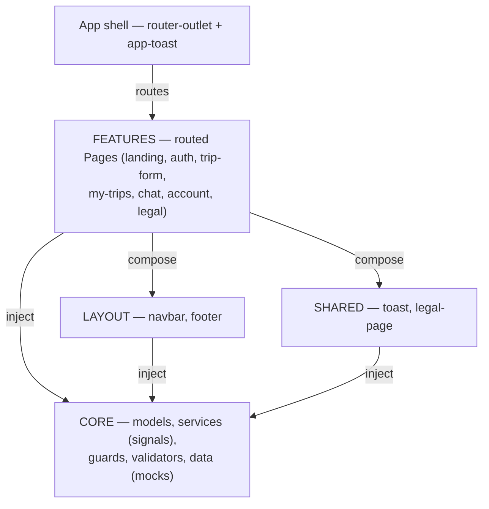
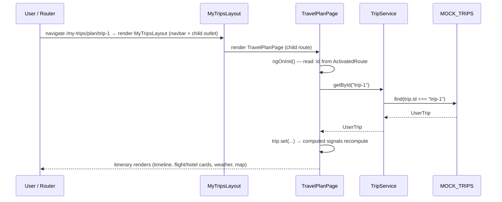

# Architecture

TripMind is a standalone-component Angular 20 SPA with **no backend**. State is held in
**signals** inside singleton services; data is served from in-memory mocks and persisted to
`localStorage`. This document explains how the pieces fit together and where the seams for a
real API are.

- [Layered design](#layered-design)
- [Layer responsibilities](#layer-responsibilities)
- [Data flow](#data-flow)
- [Routing & the auth policy](#routing--the-auth-policy)
- [The mock-to-backend seam](#the-mock-to-backend-seam)
- [Rendering strategy](#rendering-strategy)
- [Request flow: opening an itinerary](#request-flow-opening-an-itinerary)

---

## Layered design

The application is divided into four layers plus a thin root shell. Dependencies point
**downward only** — features depend on shared/core, but core never imports a feature.

```
┌──────────────────────────────────────────────────────────────────┐
│  App shell  (app.ts / app.html)                                    │
│  <router-outlet/> + global <app-toast/>                            │
└──────────────────────────────────────────────────────────────────┘
                              │ routes
                              ▼
┌──────────────────────────────────────────────────────────────────┐
│  FEATURES  (src/app/features)                                      │
│  landing · auth · trip-form · my-trips · chat · account · legal    │
│  Routed pages (…Page) that compose UI and inject core services.    │
└──────────────────────────────────────────────────────────────────┘
            │ use                         │ use
            ▼                             ▼
┌───────────────────────────┐   ┌──────────────────────────────────┐
│  LAYOUT (src/app/layout)  │   │  SHARED (src/app/shared)          │
│  navbar · footer          │   │  toast · legal-page               │
│  App chrome reused across │   │  Reusable, presentation-oriented  │
│  features.                │   │  components.                      │
└───────────────────────────┘   └──────────────────────────────────┘
            │                             │
            └──────────────┬──────────────┘
                           ▼
┌──────────────────────────────────────────────────────────────────┐
│  CORE  (src/app/core)                                              │
│  models · services (signals) · guards · validators · data (mocks) │
│  Framework-agnostic domain logic. Imports nothing from features.   │
└──────────────────────────────────────────────────────────────────┘
```



---

## Layer responsibilities

### Core — `src/app/core`

The dependency-free foundation. Contains everything that is not a screen.

| Folder | Responsibility |
| --- | --- |
| `models/` | PascalCase TypeScript interfaces describing the domain (`UserTrip`, `DayPlan`, `Activity`, `Weather`, `FlightInfo`, `HotelInfo`, `TripData`, `UserProfile`, `NotificationPreferences`, `ChatMessage`/`ChatItinerary`/`ChatSession`). Re-exported through a barrel `index.ts`. |
| `services/` | Singleton, signal-based state holders and side-effect owners (`AuthService`, `TripService`, `ChatService`, `UserProfileService`, `PreferencesService`, `ToastService`, `PdfExportService`). All `providedIn: 'root'`. |
| `guards/` | Functional route guards — currently `authGuard`. |
| `validators/` | Pure reactive-forms validators (`emailValidator`, `passwordMatchValidator`, `dateRangeValidator`). |
| `data/` | In-memory mock datasets (`mock-trips.data.ts`). The single source of truth for trips today; the swap point for a real API. |

### Layout — `src/app/layout`

Application chrome that is reused across features but is not generic enough to be "shared":

- **`navbar`** — fixed, auth-aware top navigation with a responsive mobile drawer. Injects
  `AuthService` to show the right menu and to log out.
- **`footer`** — site footer.

### Shared — `src/app/shared`

Reusable, presentation-oriented components consumed by multiple features:

- **`toast`** — the single global toast host (`<app-toast>`). Renders whatever
  `ToastService` currently holds; mounted once in the app shell.
- **`legal-page`** — shared chrome (navbar + header card + footer) for policy pages; the
  page-specific prose is projected through `<ng-content>`.

### Features — `src/app/features`

The routed screens. Each feature is a folder of standalone components. Routed entry points
use the `Page` suffix (`LoginPage`, `TravelPlanPage`, …); supporting presentational pieces
use descriptive names (`FlightCard`, `WeatherBanner`, `InteractiveMap`). Features compose
layout/shared components and inject core services — they never reach into each other.

---

## Data flow

The flow is deliberately one-directional and simple:

```
Component  ──calls method──▶  Injectable service (signals)  ──reads/writes──▶  Mock data / localStorage
    ▲                                   │
    └──────── signal change ────────────┘
        (template auto re-renders)
```

1. A **component** injects a service and calls a method (e.g. `auth.login(...)`,
   `tripService.getById(id)`, `chat.addUserMessage(text)`).
2. The **service** mutates a private `signal` (or returns mock data) and, where relevant,
   reads/writes `localStorage`.
3. Any template that reads the service's exposed (read-only) signal **re-renders
   automatically** — no manual subscriptions, no `async` pipe, no store dispatch.

State that must survive a page refresh (auth session, profile, preferences) is mirrored into
`localStorage` behind try/catch guards, so a storage failure (private mode, SSR) degrades
gracefully to in-memory-only. For the full per-service signal surface, see
[state-management.md](./state-management.md).

---

## Routing & the auth policy

Routes are declared centrally in [`app.routes.ts`](../src/app/app.routes.ts) and registered
via `provideRouter(routes)` in [`app.config.ts`](../src/app/app.config.ts). Every route maps
directly to a standalone component (no lazy `loadChildren` modules).

| Path | Component | Access |
| --- | --- | --- |
| `''` | `LandingPage` | Public |
| `login` | `LoginPage` | Public |
| `signup` | `SignupPage` | Public |
| `forgot-password` | `ForgotPasswordPage` | Public |
| `plan` | `TripFormPage` | Public |
| `about` | `AboutPage` | Public |
| `terms` | `TermsPage` | Public |
| `privacy` | `PrivacyPage` | Public |
| `chat` | `ChatPage` | Public |
| `profile` | `ProfilePage` | Public |
| `settings` | `SettingsPage` | Public |
| `my-trips` | `MyTripsLayout` | Public |
| `my-trips` → `''` | `MyTripsPage` (child) | Public |
| `my-trips` → `plan/:id` | `TravelPlanPage` (child) | Public |
| `portfolio` | → redirect to `profile` | Public redirect |
| `**` | → redirect to `''` | Wildcard fallback |

The **`my-trips`** route is a nested layout: `MyTripsLayout` renders a persistent navbar and
its own `<router-outlet>`, into which the list (`MyTripsPage`) or a single itinerary
(`TravelPlanPage`) is rendered.

### Authentication policy: gated at save, not at the route

**Every page is publicly browsable.** No route in `app.routes.ts` declares a `canActivate`
guard, so `/my-trips`, `/chat`, `/profile`, and `/settings` are all reachable without signing
in. The app no longer bounces logged-out users away from these routes.

Authentication is enforced at exactly **one** point: **saving a chat-generated itinerary**.
The "Save Plan" button on the chat view calls `ChatPage.savePlan()`, which checks
`AuthService.isLoggedIn()`. Logged-out users get a toast ("Please sign in to save this plan.")
and are redirected to `/login?returnUrl=/chat`; logged-in users get a success toast.

```ts
// src/app/features/chat/chat.ts
savePlan(): void {
  if (!this.auth.isLoggedIn()) {
    this.toast.danger('Please sign in to save this plan.');
    this.router.navigate(['/login'], { queryParams: { returnUrl: '/chat' } });
    return;
  }
  this.toast.success('Plan saved to your trips!');
}
```

`LoginPage` reads that `returnUrl` query parameter after a successful sign-in and navigates
the user back to their intended destination (defaulting to `/my-trips`), so the save-plan
redirect returns the user to `/chat`.

### The auth guard (available for future use)

[`authGuard`](../src/app/core/guards/auth-guard.ts) is a functional `CanActivateFn`. It
injects `AuthService`, checks the `isLoggedIn` computed signal, and either allows activation
or redirects logged-out users to `/login`, preserving where they were headed:

```ts
export const authGuard: CanActivateFn = (_route, state) => {
  const auth = inject(AuthService);
  const router = inject(Router);

  if (auth.isLoggedIn()) {
    return true;
  }
  return router.createUrlTree(['/login'], { queryParams: { returnUrl: state.url } });
};
```

> **Not currently wired to any route.** The guard still exists and is unit-tested
> ([`auth-guard.spec.ts`](../src/app/core/guards/auth-guard.spec.ts)), but `app.routes.ts` no
> longer imports or applies it. It is kept as a ready-made building block should any route need
> protecting again later — apply it with `canActivate: [authGuard]`.

---

## The mock-to-backend seam

Because **every** data access goes through a service method, the services are the single,
well-defined boundary where the in-memory mock can be replaced by real HTTP — without
changing any component or template.

The seam is documented directly in the code. For example, `TripService` keeps the same
return types regardless of source:

```ts
// src/app/core/services/trip.service.ts
@Injectable({ providedIn: 'root' })
export class TripService {
  /** All trips belonging to the user. */
  getAll(): UserTrip[] {
    return MOCK_TRIPS;                              // ← swap for an HTTP GET
  }

  /** A single trip by id, or `undefined` if it does not exist. */
  getById(id: string): UserTrip | undefined {
    return MOCK_TRIPS.find((trip) => trip.id === id); // ← swap for an HTTP GET /trips/:id
  }
}
```

The same applies elsewhere:

- **`AuthService.login` / `register`** — currently accept any non-empty credentials and
  persist the email to `localStorage`; replace the bodies with a real auth call returning a
  token. The public signal surface (`currentEmail`, `isLoggedIn`) stays identical.
- **`ChatService.addAssistantReply`** — currently routes through a deterministic keyword
  matcher (`matchItinerary`); replace `generateAssistantReply`/`matchItinerary` with a
  streaming API call.
- **`UserProfileService` / `PreferencesService`** — `localStorage` read/write would become
  `GET`/`PUT` to a profile/preferences endpoint.

When the backend lands, the realistic migration is to return `Observable`/`Promise` from
these methods (or push results into the existing signals) and let the same components consume
them. The mock dataset (`core/data/mock-trips.data.ts`) is the only file that becomes
obsolete.

---

## Rendering strategy

- **Standalone components everywhere.** There are no `NgModule`s. Each component declares its
  own `imports`, and the application is bootstrapped from `app.config.ts`.
- **Thin shell.** [`App`](../src/app/app.ts) imports only `RouterOutlet` and the global
  `Toast`; [`app.html`](../src/app/app.html) is just `<router-outlet />` + `<app-toast />`.
- **Signals for state.** Components hold local view state in `signal()`/`computed()` and read
  shared state from services' read-only signals. Templates that read a signal re-render when
  it changes — no manual subscription management.
- **`OnPush` on leaf/presentational components.** Pure presentational components — e.g.
  [`FlightCard`](../src/app/features/my-trips/itinerary/flight-card/flight-card.ts) and
  [`Toast`](../src/app/shared/toast/toast.ts) — declare
  `changeDetection: ChangeDetectionStrategy.OnPush`, so they only re-check when their inputs
  or the signals they read change.
- **Lazy, browser-only heavy work.** `PdfExportService` uses a dynamic
  `import('jspdf')` so jsPDF never loads during SSR and stays out of the initial bundle;
  Leaflet map work is similarly guarded with `isPlatformBrowser`.

---

## Request flow: opening an itinerary

Navigating to **`/my-trips/plan/trip-1`** is a public route, so it loads directly — no guard
runs. It exercises the nested layout and the service-to-signal data flow end to end:



Step by step:

1. **Layout.** The route is public, so navigation activates `MyTripsLayout` directly, which
   renders the navbar and a child `<router-outlet>`.
2. **Page.** `TravelPlanPage` activates, reads the `:id` route param in `ngOnInit`, and calls
   `TripService.getById(id)`.
3. **Data.** `TripService` looks the trip up in `MOCK_TRIPS` and returns a `UserTrip` (or
   `undefined`).
4. **Render.** The page stores the result in a `signal` (or flips a `notFound` signal). Its
   `computed` signals — current day, activities, weather, budget percentage — recompute, and
   the timeline, `FlightCard`, `HotelCard`, `WeatherBanner`, and `InteractiveMap` render.
   A one-click **Export to PDF** action calls `PdfExportService.exportTrip(trip)`.
